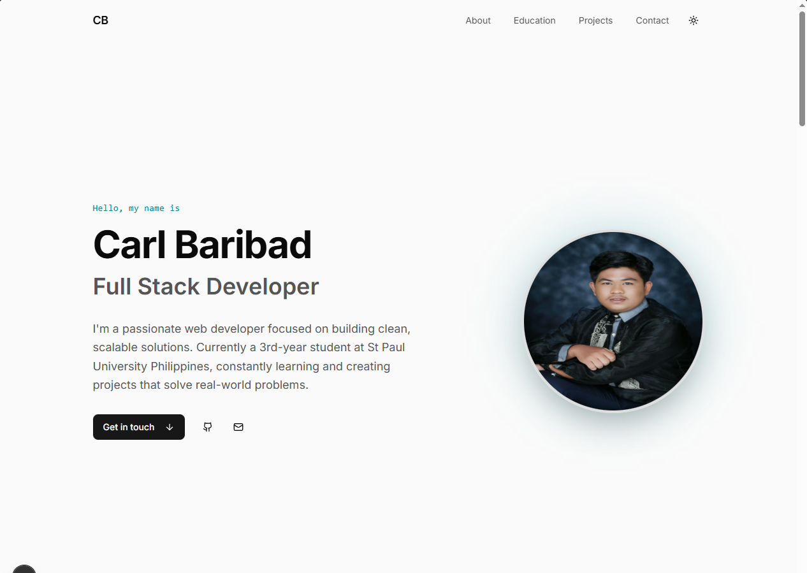
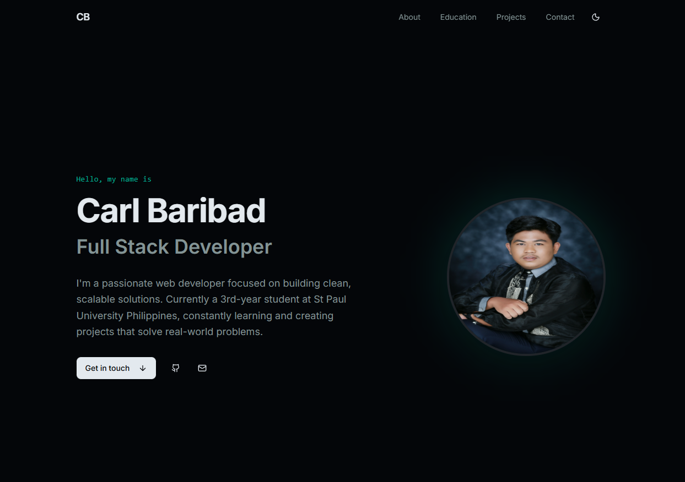

# Professional CV Website

A modern, responsive CV website built with Next.js 15, Shadcn UI, and AI generation from v0.dev. Features a professional design with dark/light mode toggle and comprehensive portfolio sections.

## 🎯 Features

- **Next.js 15** - Latest React framework with App Router
- **Shadcn UI** - Beautiful, accessible React components
- **Dark/Light Mode** - Theme toggle using next-themes
- **Responsive Design** - Mobile-first, works on all devices
- **Professional Layout** - Comprehensive CV sections including:
  - Professional profile with headshot
  - Career summary and bio
  - Skills and competencies
  - Work experience and projects
  - Education background
  - Social links and contact info
- **AI-Generated UI** - Created with v0.dev for modern aesthetics
- **Tailwind CSS** - Utility-first CSS framework
- **Optimized Performance** - Fast loading and SEO-friendly

## 🚀 Getting Started

### Prerequisites
- Node.js 18+ 
- npm or yarn

### Installation

1. Clone the repository:
```bash
git clone https://github.com/yourusername/cv-website-carlbaribad.git
cd cv-website-carlbaribad
```

2. Install dependencies:
```bash
npm install
```

3. Run development server:
```bash
npm run dev
```

4. Open [http://localhost:3000](http://localhost:3000) in your browser

## 🛠️ Customization

### Add Your Information

1. **Profile Image**: Place your headshot in `public/avatar.jpg` or `public/profile.jpg`
2. **Personal Info**: Edit the main content in `app/page.tsx`
3. **Skills**: Update skills section with your technical competencies
4. **Experience**: Add your work history, academic projects, internships
5. **Education**: Include your university and certifications
6. **Projects**: Add your portfolio projects with descriptions
7. **Social Links**: Update contact information and social media URLs

### Styling

- **Colors**: Configure in `tailwind.config.js` and CSS variables in `app/globals.css`
- **Fonts**: Typography settings in `app/layout.tsx`
- **Theme**: Dark/light mode handled by `next-themes`

## 📦 Build & Deployment

### Build for Production
```bash
npm run build
npm start
```

### Deploy to Vercel

1. Push your code to GitHub
2. Visit [vercel.com](https://vercel.com)
3. Import your GitHub repository
4. Vercel automatically deploys on git push

**Live Site**: [Your Vercel URL will appear here after deployment]

## 🤖 AI Generation Approach

This website was created using **v0.dev**, an AI-powered interface generator that uses:
- Claude AI for understanding requirements
- Modern UI best practices
- Tailwind CSS and component-based architecture

The AI generated the initial structure and components, which were then customized with personal content and refined for the best user experience.

### v0.dev Project
[Link to your v0.dev project will go here]

## 📱 Responsive Design

The website is fully responsive and tested on:
- ✅ Desktop (1920px, 1440px)
- ✅ Tablet (768px)
- ✅ Mobile (375px)

## 🌓 Dark/Light Mode

Toggle between themes using the button in the header. Your preference is saved in localStorage.

## 📄 Project Structure

```
cv-website-carlbaribad/
├── app/
│   ├── layout.tsx          # Root layout with theme provider
│   ├── page.tsx            # Main CV page
│   └── globals.css         # Global styles
├── components/
│   ├── header.tsx          # Navigation header
│   ├── theme-toggle.tsx    # Dark/light mode toggle
│   └── ...                 # Other components
├── public/
│   ├── avatar.jpg          # Profile image
│   └── ...                 # Static assets
├── tailwind.config.js      # Tailwind configuration
├── next.config.js          # Next.js configuration
└── package.json            # Dependencies
```

## 🔧 Technologies

- **Framework**: Next.js 15
- **UI Components**: Shadcn UI
- **Styling**: Tailwind CSS
- **Theme**: next-themes
- **Deployment**: Vercel
- **Version Control**: Git & GitHub

## 📸 Screenshots

### Light Mode


### Dark Mode



## 🤝 Contributing

This is a personal CV website. For issues or improvements, feel free to create a pull request.

## 📄 License

This project is open source and available under the [MIT License](LICENSE).

## 👤 Author

**Your Name**
- GitHub: (https://github.com/lilciddump-pixel)
- Email: cjbaribad@gmail.com

---

**Built with AI** 🤖 using v0.dev
w